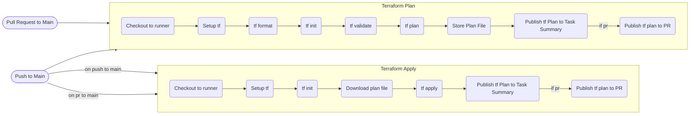

# CD-demo-tf-branching-1

Demo repo for terraform branching

## Pipeline Flow

### Notes

1. Plan stage uses write credentials currently. Use separate credentials for plan and apply stages.
2. Each env uses same credentials, use separate for each env in future
